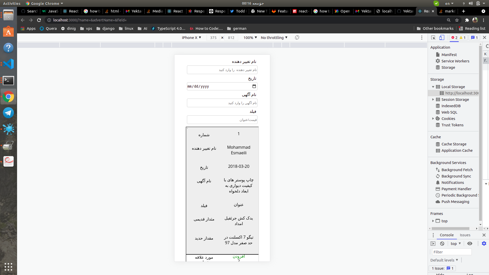
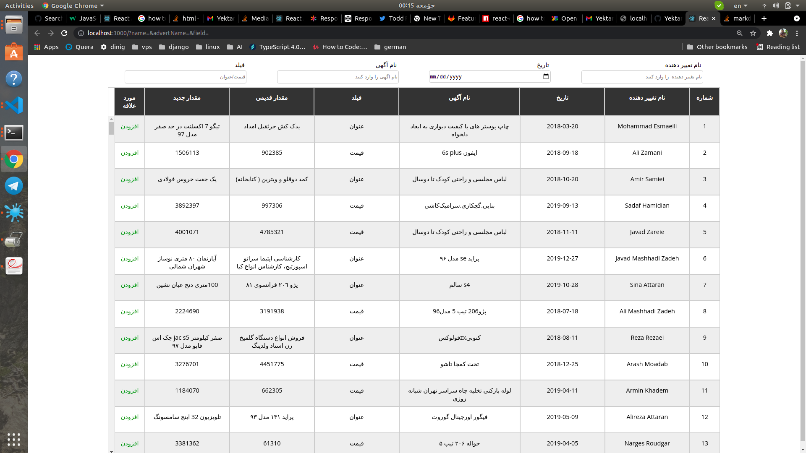

#This Task Has Got Accepted From Yektanet Technical Team Lead.

# Rendering 100,000 json object with React, (Yektanet Interview Task )

### using binarySearchTree for storing and searching the changeDate of objects, if you want to set date-input to default just refresh the page or type on another inputs.
### you can filter list by userName, advertName and field together but date seperately, according to task explanation.
### userName, advertName and field remain after refreshing the page but date set to default because we are rendering date-filter  from bst .
### you can add your favorites data to localStorage by clicking the fav column;
### While Changing to mobie view in browser after changing, please refresh the page to update the mobile view styles

